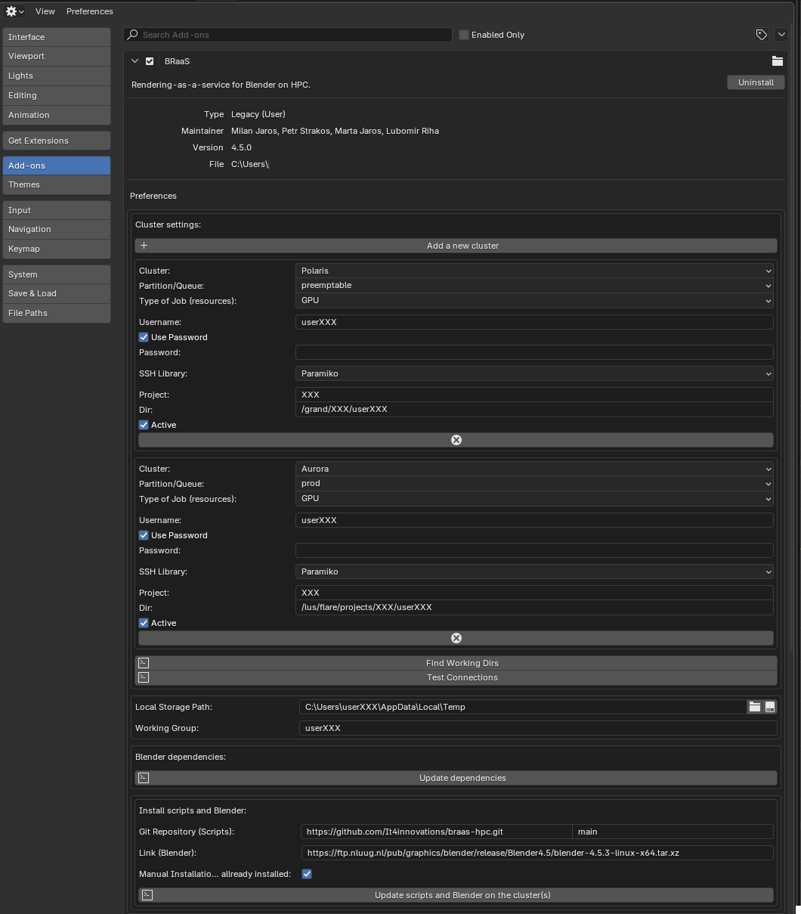
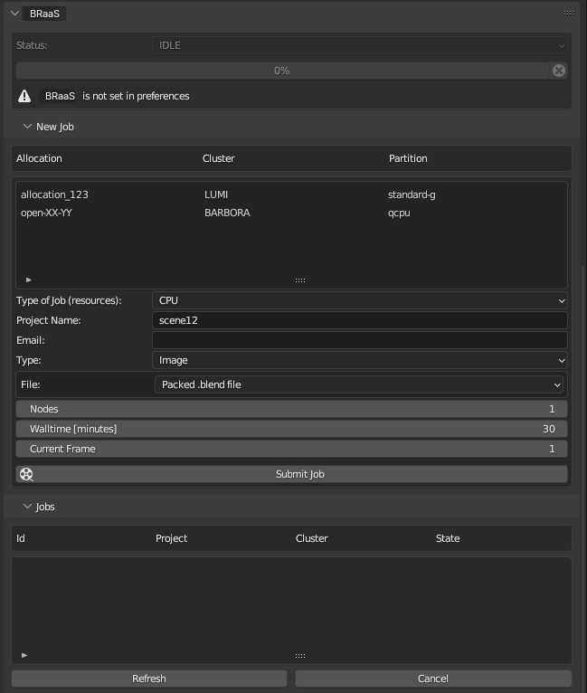
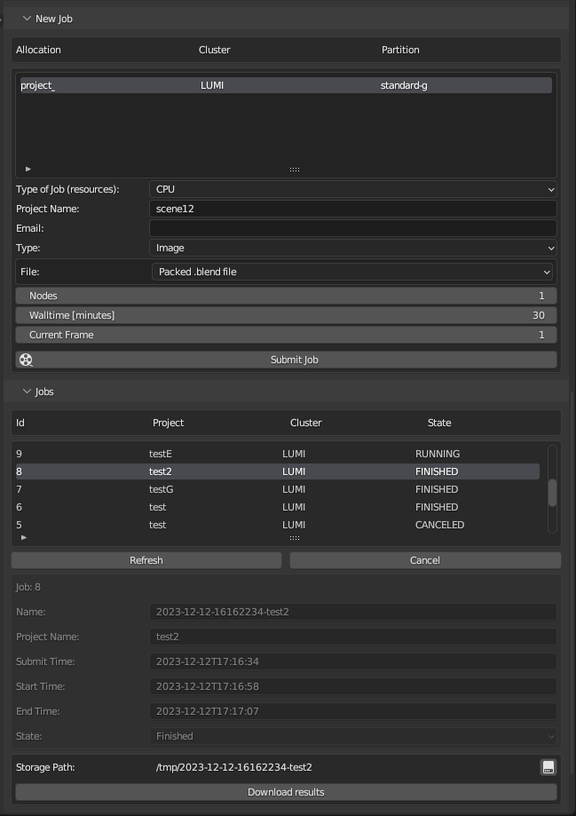

# BRaaS-HPC (Rendering-as-a-service for Blender on HPC)

#### BLENDER ADD-ON TO EXTEND ITS CAPABILITIES IN TERMS OF RENDERING ON AN HPC CLUSTER

We provide a Python add-on for Blender that can re-formulate a typical user scene rendering task into a specific HPC computational job, which currently works only as an SSH remote client. This add-on has been developed at [IT4Innovations National Supercomputing Center](https://www.it4i.cz/).

# BRaaS-HPC Release Information
Support of Slurm-based HPC clusters:
- Support of [Karolina](https://www.it4i.cz/en/infrastructure/karolina) supercomputer
- Support of [Barbora](https://www.it4i.cz/en/infrastructure/barbora) supercomputer
- Support of [Lumi](https://lumi-supercomputer.eu) supercomputer
- Support of [Leonardo](https://www.hpc.cineca.it/systems/hardware/leonardo/) supercomputer
- Support of [MareNostrum 5](https://www.bsc.es/marenostrum/marenostrum-5) supercomputer

Support of PBS-based HPC clusters:
- Support of [Polaris](https://www.alcf.anl.gov/polaris) supercomputer
- Support of [Aurora](https://www.alcf.anl.gov/aurora) supercomputer

New features:
- New graphical user interface for clusters
- Bug fixes from the previous version

# Content
1. [Installation & Authentication](https://github.com/It4innovations/braas-hpc#installation-authentication)
2. [Compatibility](https://github.com/It4innovations/braas-hpc#compatibility)
3. [Add-on functionality](https://github.com/It4innovations/braas-hpc#add-on-functionality)
4. [License](https://github.com/It4innovations/braas-hpc#license)
5. [Acknowledgement](https://github.com/It4innovations/braas-hpc#acknowledgement)

# Installation & Authentication
For add-on installation you first read Installation and Setup Guide (TODO).

# Compatibility
Add-on is compatible with Blender version 4.0 and higher. Older versions of Blender software are not supported.
Add-on has been tested on a Linux platform.

# Add-on functionality
BRaaS-HPC add-on properties can be set in ***Blender Preferences*** menu, see figure below.
    

1. Users first define their credentials for accessing remote HPC clusters, including a username, the path to a private SSH key, and its password.

2. Users can create multiple HPC cluster presets via "Cluster settings," differing in allocation projects, HW queues/partitions, and project directories. After setting the project directory (manually or using "Find Working Dirs" button), presets can be marked as active, and only active presets are available in the add-on render properties. These presets are specific to a user account. New presets can be added ("Add a new cluster" button), and unused presets can be deleted (cancellation button "X" in the corresponding row).

3. Users can set the local storage path (default: "/tmp") and a working group.

4. The "Install/Update dependencies" button installs Python packages required by the add-on.

5. Users specify the repository and branch from which essential scripts for remote rendering are installed. Pressing "Install/Update scripts" initiates the installation process, which may include downloading Blender.

The status of installed dependencies, scripts, user credentials, and cluster settings is displayed in the Status menu in Render properties.

BRaaS-HPC add-on is added to the ***Render properties*** menu of Blender.
Add-on supports *Cycles* rendering only.
Thus it is available only in case *Cycles* is selected as *Render Engine*.

***BRaaS-HPC*** menu is divided in ***Status***, ***New Job*** and ***Jobs*** menus.
See figure below. 

***Status*** menu provides user with information about progress of ongoing action, e.g., sending query for job update etc.

***New Job*** menu enables to define details about a rendering job and submit this job to the selected remote cluster. The particular cluster, allocation and HW partition is selected in the correspoding table. Users can set a project name, specify their email to receive notifications when job is done (only in case you have been assigned computational resources and this email address was used), specify execution parameters (see below) and choose whether to render only a single image or sequence of images (animation).
 

Execution parameters are:

- *Nodes* - number of allocated computational nodes for the rendering job.
- *Walltime* - maximum processing time allocated for a specific part of the whole rendering task such as *Preprocessing*, *Rendering*, *Postprocessing*.
- *Current Frame* or *Frame Start/End/Step* - depending whether a single image or animation is selected, users can choose a frame number or consecutive set of frames.

Additional settings regarding to the rendered image/images such as resolution, aspect ratio, etc. can be set in a standard way from ***Output properties*** menu of Blender. Setting of a number of samples per pixel during rendering can be done as common from ***Output properties*** menu of Blender. 

After setting important values, rendering job is offloaded to the cluster by ***Submit Job*** button.  

***Jobs*** menu provides an overview about the submitted jobs showing their actual states and target remote machines.

If some particular job from the list in the ***Jobs*** menu is selected, users can download the results to their local folder and browse them by opening a file explorer via a corresponding button. Final and partial results may be downloaded if exist. Jobs in the list that are not finalized can be cancelled on demand by selection the row with the particular job and pressing "Cancel" button. Pressing "Refresh" button refreshes the statuses of jobs. Pressing this button is required from time to time because this action is not provided automatically. Sometimes users are encouraged to perform the refresh action, e.g., after submitting a new job because it may take a while until a new job is initiated on the remote site and can be monitored.

# Usage & User Projects
- **Chora** by Gaia Radić: [Aksioma](https://aksioma.org/chora), [GaiaRadic](https://www.gaiaradic.com/chora)
- **Dejvický kampus** by Michal Faltýnek: [Akademik](https://www.vsb.cz/magazin/cs/detail-novinky/?reportId=49300)
- **Holograms**: [Youtube](https://www.youtube.com/watch?v=PKPoO_0nNYA), [GitLab (private project)](https://code.it4i.cz/svo0120/holograms)
- **InfraLab Portfolio**: [IT4I](https://www.it4i.cz/en/infrastructure/visualization-and-virtual-reality-labs/examples-of-our-visualizations)
- **InnovAIte Slovakia: Illuminating Pathways for AI‑Driven Breakthroughs**: [InnovAIte](https://innovaite.sk/)
- **Massively parallel implementation of algorithms for computer graphics**: PhD Thesis by Milan Jaroš
- **Railway simulator for obsacle detection project**: [IT4I News 1](https://www.it4i.cz/en/about/infoservice/news/railway-simulator-for-obsacle-detection-project), [IT4I News 2](https://www.it4i.cz/en/about/infoservice/news/simulator-of-railway-track-conditions-can-help-enhance-railway-safety), [GitLab](https://code.it4i.cz/tacr/simulator)
- **Research Excellence For REgion Sustainability and High-tech Industries**: [REFRESH](https://www.smaragdova.cz/refresh/)
- **Scalable Parallel Astrophysical Codes for Exascale**: [SPACE CoE](https://www.space-coe.eu)
- **Spring**: [Youtube](https://www.youtube.com/watch?v=WhWc3b3KhnY&t=1s)
- **Synthetic SEM image generator**: [GitLab](https://code.it4i.cz/SEM-Image/segment_sem_images_hctpm)
- **Workflow for high-quality visualisation of large-scale CFD simulations by volume rendering**: [Paper](https://doi.org/10.1016/j.advengsoft.2024.103822), [Zenodo](https://zenodo.org/records/13639352)
- **ELI Beamlines**:[9th Users’ Conference of IT4Innovations](https://events.it4i.cz/event/346/attachments/820/2889/01_Valenta_Petr_Machine-learning%20optimization%20of%20laser-driven%20electron%20accelerators.pdf)
- ...

# License
This software is licensed under the terms of the [GNU General Public License](https://github.com/It4innovations/braas-hpc/blob/main/LICENSE).

# Acknowledgement
This work was supported by the Ministry of Education, Youth and Sports of the Czech Republic through the e-INFRA CZ (ID:90254).

This work was supported by the SPACE project. This project has received funding from the European High- Performance Computing Joint Undertaking (JU) under grant agreement No 101093441. This project has received funding from the Ministry of Education, Youth and Sports of the Czech Republic (ID: MC2304).

